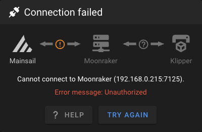

# Unauthorized

<figure><figcaption><p>Connection failed dialog with Error message Unauthorized</p></figcaption></figure>

Moonraker uses the `trusted_clients` list in the `[authorization]` section of its configuration to specify IP addresses authorized to connect to the API. You need to identify the allowed IP range and add it to this list. To check which IP addresses are requesting access to Moonraker, you can review the `moonraker.log` file. Lock at the end of the `moonraker.log` file (this file should be located at `~/printer_data/logs/moonraker.log`) and you should find these lines:

```
2024-10-26 18:18:43,340 [application.py:log_request()] - 101 GET /websocket (192.168.0.31) [No User] 9.56ms
2024-10-26 18:18:43,341 [websockets.py:open()] - Websocket Opened: ID: 281473655837840, Proxied: False, User Agent: Mozilla/5.0 (Macintosh; Intel Mac OS X 10_15_7) AppleWebKit/537.36 (KHTML, like Gecko) Chrome/130.0.0.0 Safari/537.36, Host Name: 192.168.0.215
2024-10-26 18:18:43,351 [common.py:build_error()] - JSON-RPC Request Error - Requested Method: server.connection.identify, Code: -32602, Message: Unauthorized
2024-10-26 18:18:53,496 [websockets.py:on_close()] - Websocket Closed: ID: 281473655837840 Close Code: None, Close Reason: None, Pong Time Elapsed: 0.15
```

In the first line, you can see the client IP that attempted to connect. In this case, the IP address is `192.168.0.31`. If you want to allow the entire IP range, you can add `192.168.0.0/24` to the `trusted_clients` list. This will permit all clients with IPs from `192.168.0.0` to `192.168.0.255` to connect to Moonraker.

Now you need to add the IP or IP range to the `moonraker.conf` file. You can do this via SSH or using an SFTP program (such as FileZilla). The `[authorization]` section should now look like this:

```yaml
[authorization]
trusted_clients:
    10.0.0.0/8
    127.0.0.0/8
    169.254.0.0/16
    172.16.0.0/12
    FE80::/10
    ::1/128
    192.168.0.0/24
cors_domains:
    *.lan
    *.local
    *://localhost
    *://localhost:*
    *://my.mainsail.xyz
```
