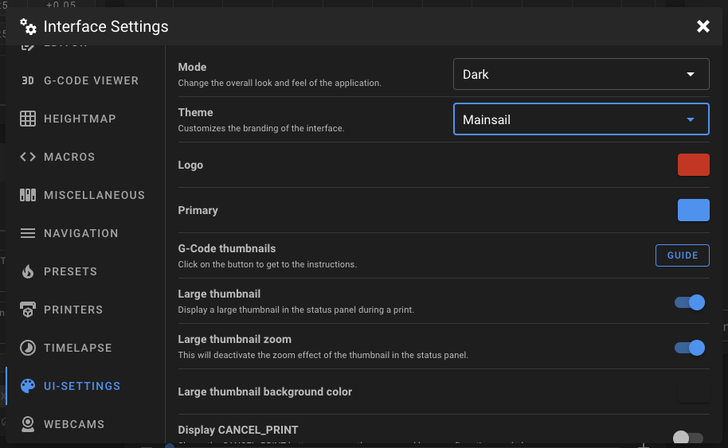

# Build-in Themes

In Mainsail, there are two groups that are permitted to have build-in themes. The first group consists of all vendor sponsors, who receive exclusive themes as a recognition of their support. The second group includes large open source communities.&#x20;


If you are a maintainer of a large open-source 3d printing project, please contact the Mainsail crew on the Discord server for a build-in theme.


### Change theme in Mainsail

<figure><figcaption>
Interface Settings > UI-Settings
</figcaption></figure>

To change the Theme in Mainsail, open the `Interface Settings` (cogs-menu on the right top), switch to `UI-Settings` and select a theme in the dropdown.

The following themes are currently available in Mainsail:

* Mainsail (default theme)
* Klipper
* Voron Design
* VzBot
* BigTreeTech (Sponsor)
* LDO Motion (Sponsor)
* Multec GmbH (Sponsor)
* Prusa Research (Sponsor)
* YUMI (Sponsor)

### Possible options in Build-in themes

* Sidebar Logo (colorizeable in the UI-Settings)
* Primary Color
* Sidebar Background
* Main Background
* Custom CSS

Most themes only change the sidebar logo and favicon with the logo and primary color.&#x20;
