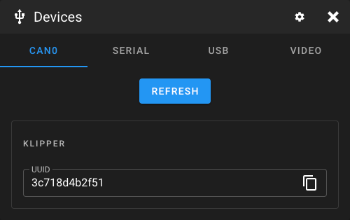

# Query devices

## CAN devices

You can display "not connected" CAN nodes in this tab. Unfortunately, there is no more information except the application (Klipper/Katapult) and the related UUID.

<figure><figcaption>
Screenshot find devices dialog with CAN devices.
</figcaption></figure>


An "unassigned" node is a CAN node that has not been activated by Katapult or Klipper. If either Klipper or Katapult has connected to the node, it will be assigned a Node ID and therefore will no longer respond to queries. A device reset is required to remove the assignment.

When multiple unassigned nodes are on the network, each responds to the query at roughly the same time. This results in arbitration errors. Nodes will retry the send until the response reports success. However, nodes track the count of arbitration errors, and once a specific threshold is reached they will go into a "bus off" state. A device reset is required to reset the counter and recover from "bus off".

For this reason, it is recommended that users only issue a query when a single unassigned node is on the network. If a user does wish to query multiple unassigned nodes it is vital that they reset all nodes on the network before running Klipper.\
\
Source: [https://moonraker.readthedocs.io/en/latest/web\_api/#query-unassigned-canbus-uuids](https://moonraker.readthedocs.io/en/latest/web\_api/#query-unassigned-canbus-uuids)


## Serial devices

This tab is essential for Klipper printers. The connections to the printer mainboard are displayed here.

<figure><figcaption>
Screenshot find devices dialog with Serial devices.
</figcaption></figure>

## USB devices

This tab is intended for debugging. Here, you can see whether the system recognizes the connected USB device.

<figure><figcaption>
Screenshot find devices dialog with USB devices.
</figcaption></figure>

## Video devices

All libcamera and V4L2 webcams are listed in this tab. Furthermore, all useable resolutions and video formats are displayed.

<figure><figcaption>
Screenshot find devices dialog with Video devices.
</figcaption></figure>
