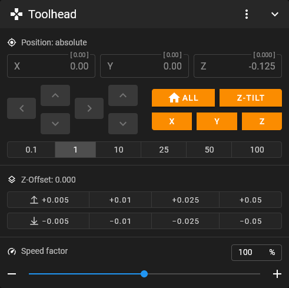
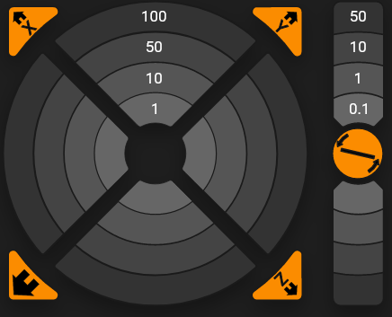
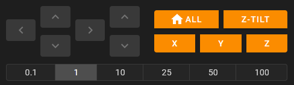

# Control

Go to the [settings](./) and select the Control category.

## Toolhead

In this passage, the customizing possibilities for this panel are described.

### Style

Choose the appearance of the Toolhead motion controls. Available choices:

#### Bars

#### Circle

#### Cross

### Enable combined X & Y axes homing

Have a combined button for homing the X\&Y axes. Otherwise, there are two individual buttons.

### Invert X Axis movement direction

This inverts the direction of the X axis, when moving through the interface.

### Invert Y Axis movement direction

This inverts the direction of the Y axis, when moving through the interface.

### Invert Z Axis movement direction

This inverts the direction of the Z axis, when moving through the interface.

Some users prefer to move the print bed instead of the toolhead. For example, in a CoreXY printer, when the option is active, moving Z in the negative direction sends the print bed down, away from the toolhead. Normally, the toolhead would move down towards the print bed when you move Z in the negative direction.

### Movement speed X & Y axes

Set how fast the X\&Y axes should move when controlled by the toolhead control.

### Movement speed Z axis

Set how fast the Z axis should move when controlled by the toolhead control.

### Move distances (in mm)

Customize the distances in mm the toolhead may travel. A maximum of 9 values are allowed.&#x20;

### Z-Offset increments (in mm)

Customize the distances in mm the Z offset can be adjusted. A maximum of 4 values are allowed.&#x20;

## Extruder

In this passage, the customizing possibilities for this panel are described.

### Extrusion amount presets (in mm)

Define some presets of filament lengths for extruding via the interface.&#x20;

Don't worry, you can also enter the value by hand in the panel itself.

### Extrusion speed presets (in mm/s)

Define some presets of extrusion speeds when extruding via the interface. After you figured out the maximum extrusion speed of your hotend, you may want to map it here.&#x20;

Note that you can also enter this value directly in the panel.

### Show estimated extrusion info

This option allows you to hide the calculation in the extruder panel.

