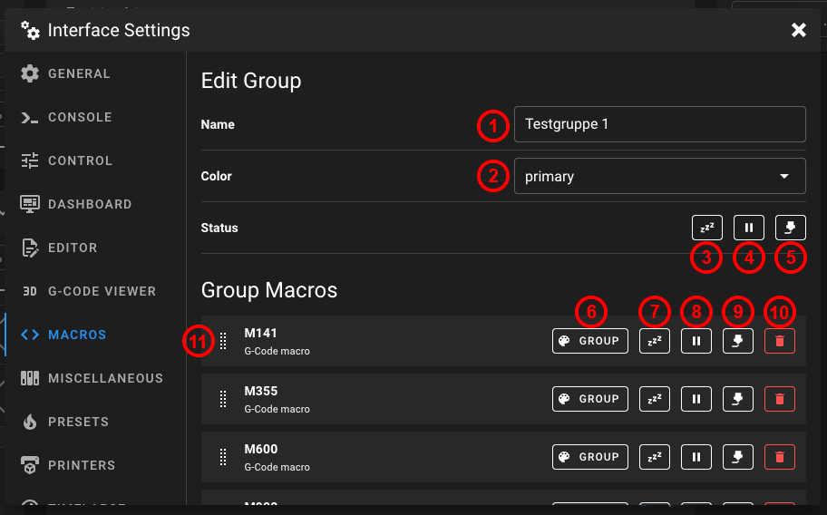

# Macros

## Simple Mode

This mode is very simple to manage your `gcode_macro`s. You can only hide macros which one you don't want to see on the dashboard. All macros are displayed alphabetically in a panel on the dashboard.

<figure><figcaption>
Macro settings (Mode: simple)
</figcaption></figure>

## Expert Mode

In this mode, you can create individual groups. Each group is displayed as a separate panel on the dashboard and can be positioned independently in the dashboard.

<figure><figcaption>
Macro settings (Mode: expert)
</figcaption></figure>

Each group can then be individually equipped, and the visibility can be individually adjusted.

<figure><figcaption>
Group settings in Macro settings (Mode: expert)
</figcaption></figure>

1. Group name
2. Group button color
3. Group status `idle` (should this group be displayed, when the printer is in idle)
4. Group status `pause` (should this group be displayed, when the printer is in pause)
5. Group status `printing` (should this group be displayed, when the printer is printing)
6. Macro button color (global group color or independent color)
7. Macro status `idle` (should this macro be displayed, when the printer is in idle)
8. Macro status `pause` (should this macro be displayed, when the printer is in pause)
9. Macro status `printing` (should this macro be displayed, when the printer is printing)
10. Delete this macro from this group
11. Resort this macro in this group
