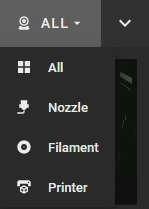

# Webcams

## Prerequisites

To be able to add a stream to Mainsail, it must be available as a so-called “MJPEG stream”.

So either you have a network camera that offers such a stream by itself, or you use a conventional webcam (USB camera, Raspberry Pi Camera, …) that is connected to your system. For a non-network cameras, you need to install and configure a streamer software on your system, such as [Crowsnest](https://app.gitbook.com/o/O2j4rN2JOaGEeS1KBjXz/s/qXE1OQLsr0XFNbT54RTY/).&#x20;


[MainsailOS ](https://app.gitbook.com/o/O2j4rN2JOaGEeS1KBjXz/s/HZGYoL7ogomNyBLNEpEJ/)comes preinstalled with [Crowsnest](https://app.gitbook.com/o/O2j4rN2JOaGEeS1KBjXz/s/qXE1OQLsr0XFNbT54RTY/) as streamer. If you wish to install Crowsnest on your system, or need assistance in configuring Crowsnest, please refer to its documentation.


Once such a stream is available, you only have to configure it in the Mainsail settings.&#x20;

## Settings

Go to the [settings](./) and select the Webcams category.

In this view, you can add new webcams, or edit and remove existing ones.

While adding or editing a webcam, you will see the following screen.

\[Insert Image....]

### Preview

On the right side, you can check the settings in a preview.

### Name and Icon

At first, you have to give the camera a name, and you can assign an icon to it.

### Streaming URLs

You also need to specify stream and snapshot URL. For network cameras, please consult the manufacturer's manual or search the Internet.

**Note:** In [MainsailOS](https://app.gitbook.com/o/O2j4rN2JOaGEeS1KBjXz/s/HZGYoL7ogomNyBLNEpEJ/), by default, four webcam ports are mapped to URLs. Notice that the first URL doesn't contain a number. Check which port you have configured in your streamer and add the URLs.

| Port | Stream URL              | Snapshot URL              |
| ---- | ----------------------- | ------------------------- |
| 8080 | /webcam/?action=stream  | /webcam/?action=snapshot  |
| 8081 | /webcam2/?action=stream | /webcam2/?action=snapshot |
| 8082 | /webcam3/?action=stream | /webcam3/?action=snapshot |
| 8083 | /webcam4/?action=stream | /webcam4/?action=snapshot |

### Streaming mode

You also need to select a streaming mode. Below are descriptions of the different modes, so you can decide. Try out what works best for you.

| Mode                 | Description                                                                                                                                                                                                                                                                                    |
| -------------------- | ---------------------------------------------------------------------------------------------------------------------------------------------------------------------------------------------------------------------------------------------------------------------------------------------- |
| **MJPEG (Streamer)** | 
The streamer mode extracts individual frames from the stream URL and streams them. 

This is to prevent the buildup of delay in case of insufficient bandwidth.   <strong>IMPORTANT:</strong> This mode does currently not work on iOS devices for technical reasons.
 |
| **MJPEG (Adaptive)** | 
The adaptive mode takes the snapshot <em></em> URL and pulls individual images. 

Also, this is intended to prevent a delay.
                                                                                                                                                |
| **MJPEG (Classic)**  | 
The classic mode is the plain MJPEG stream embedded in an image tag. 

In this case, it can happen that after some runtime a delay steadily builds up, because frames cannot be skipped. Only a browser reload will help.
                                                   |
| **IP-Camera**        |                                                                                                                                                                                                                                                                                                |

### Target FPS

Only in adaptive MJPEG mode, you also have to set the target frame rate. This is how often per second an image is requested.

### Image Settings

Flip the webcam vertically and/or horizontally. Both at the same time corresponds to a 180° rotation.
